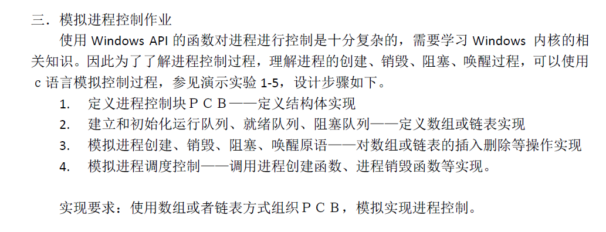

# 1. 作业要求

# 2. 构思
- 用python实现
  - 底层用C写的
  - 我们直接用python的类就能实现结构体的功能, 比较方便

- 实验模拟设备
  - 单处理机： 当前状态只有一个进程正在运行
  - 忽略进程切换和调度的时间
  - 指令类型
    - cpu, 1个时间单位
    - io, 5个时间单位
  - 进程状态
    - ready -> 就绪
    - run: cpu -> 正在执行cpu指令
    - run: io -> 正在执行io指令
    - waiting
    - done
  - cpu当前状态
    - work -> 正在工作
    - free -> 空闲
  - IO设备 -> IOs
    - work
    - free
